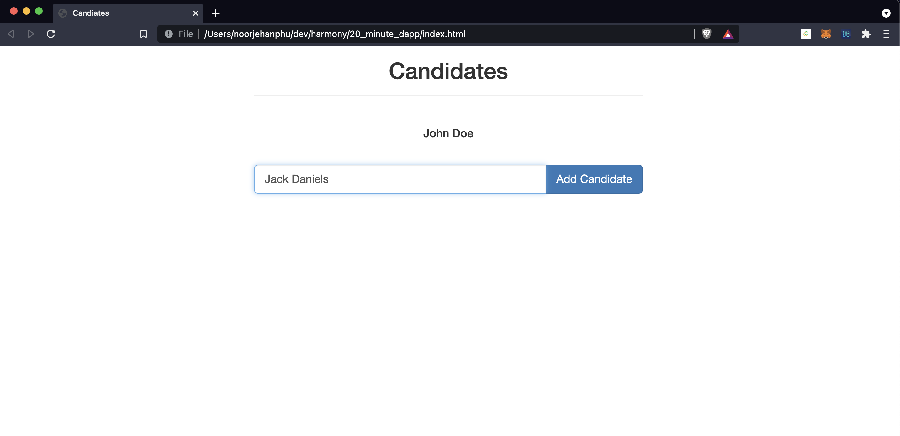
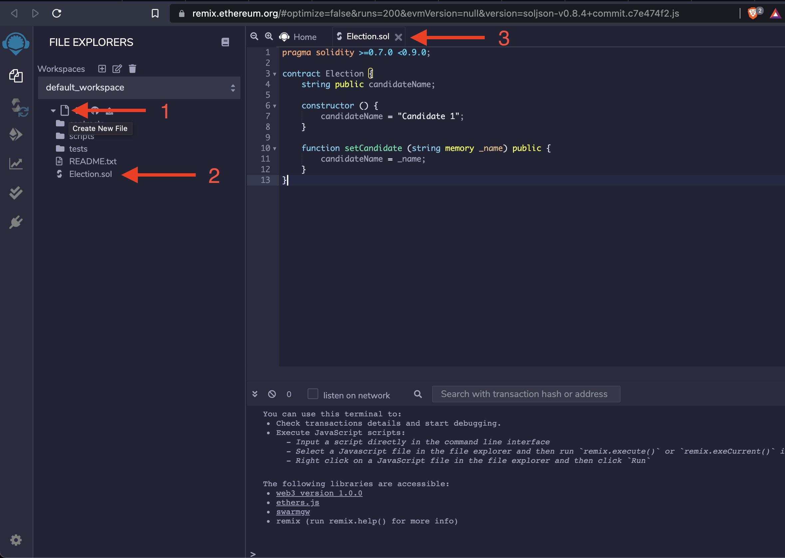
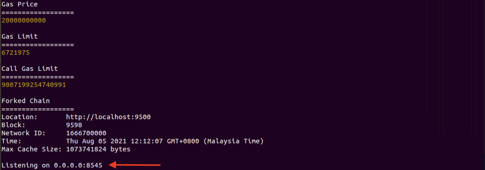
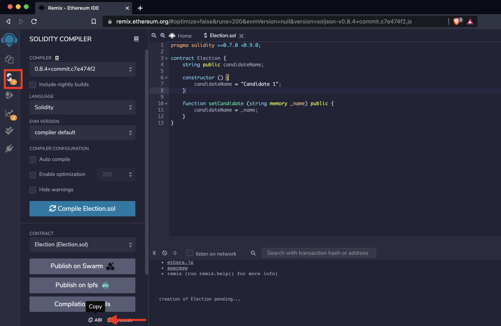
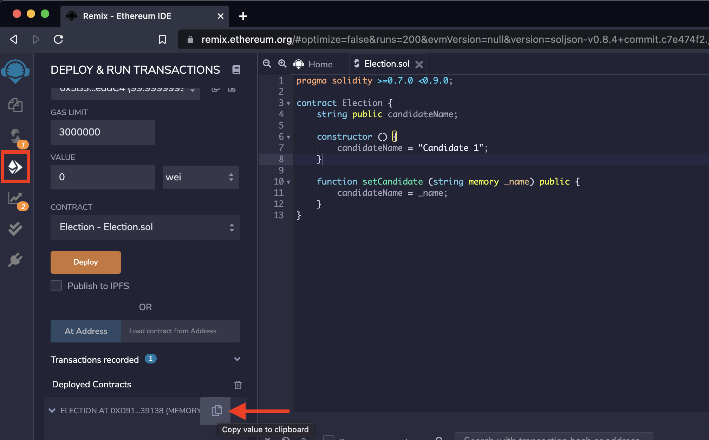

# Build a Dapp in 20 Minutes

This tutorial will teach you how to build a basic, full-stack Dapp that will connect to a smart contract deployed on a local blockchain instance. 
The goal of this tutorial is to get you familiar with the tools that make up a full-stack Dapp; which includes the blockchain and smart contracts, the deployment tools, and the libraries used to interact with the blockchain.

We will do this by creating a simple app that will represent an election. In this example, we will create a simple form that will allow users to change the candidate name and store this result onto the blockchain.



## Components of the Tutorial

Here are the tools we'll use in this tutorial:
1. [Web3 JS](https://web3js.readthedocs.io/en/v1.4.0/) - a javascript library that enables client side applications to talk to blockchain
2. [Metamask](https://metamask.io/) - a browser plugin that enables browser to talk to blockchain. This plugin is required because at this point in time most common browsers do not support talking to the blockchain out of the box. 
3. [Ganache](https://docs.harmony.one/home/developers/tools/using-ganache) - local development blockchain to deploy and test your smart contracts for free. Follow the instructions in the page linked in the description to install ganache-cli
4. [Remix](https://remix.ethereum.org/) - a web-based smart contract IDE to help deploy your smart contracts onto the blockchain

Install Metamask and Ganache-cli onto your local machine before continuing onto the next section. 

## Project Overview


Before we deep dive into the main part of this tutorial, lets look at the project structure. These are the basic files that we will require before we can start developing our dapp:
- the bootstrap library is a set of visual components that will make our user interface a bit more aesthetically pleasing.  
- the web3 library is used by our dapp to communicate with the blockchain. It will provide us with a convenient way to talk to the smart contract.
- the index.base.html file contains our front-end business logic. It will use the bootstrap and web3 libraries to connect and interact with the smart contract.

## Remix and Solidity
Lets begin by copying the smart contract and pasting it into our [remix IDE](https://remix.ethereum.org). The smart contract can be found in contracts/Election.sol. 



```javascript
pragma solidity >=0.7.0 <0.9.0;

contract Election {
    string public candidateName;

    constructor () {
        candidateName = "Candidate 1";
    }

    function setCandidate (string memory _name) public {
        candidateName = _name;
    }
}
```

The solidity file is a basic smart contract that captures a single candidate name on the blockchain. It has a constructor that defaults the candidate name to “Candidate 1”, and a function called setCandidate that changes the candidates’ name.  

The candidate name is public, which allows anyone to directly read its value.  


### Ganache Setup
We will be deploying this smart contract onto our local harmony one blockchain instance running on Ganache. First ensure that ganache is running. We will need some information on the port that its connected to. You can get this information by going to the Ganache-cli terminal and looking for the RPC Server details. By default this value is http://127.0.0.1:8585



### Configure Remix
Go back to the [remix IDE](https://remix.ethereum.org), choose web3 provider, and configure it to point to the RPC Server for the Ganache-cli in the previous section. 


When you click OK it should give you a list of pre-configured Harmony One accounts that have been pre-seeded with some sample ONE tokens.Select one of the available accounts and click compile, deploy.


Then test out the functions on the deployed smart contract. Expand the deployed contract and click the candidateName to retrieve the candidate name. It should be “Candidate 1” by default. We can change the candidate name to bob and check that its changed by clicking the candidateName again.


## Creating the Dapp
Now that we have our smart contract deployed, we can connect our dapp to the blockchain. Open up the index.base.html file and scroll to the script tags. 
In this sample dapp we will create a place to hold the candidate name and a form to update the candidate name. In a real dapp you will typically use a framework like react/angular and have a lot more files, but for this example we can put all our logic in the index.base.html file.

First, lets put some standard code in place to allow you to connect to the blockchain. This boiler plate code will use the injected web3 provider from the environment, and if that doesn’t exist will default to localhost 8545. 

```javascript
// Initialize Web3
if (typeof web3 !== 'undefined') {
    web3 = new Web3(web3.currentProvider);
} else {
    web3 = new Web3(new Web3.providers. HttpProvider('http://localhost:8545'));
}
```

Next we need to tell web3 to use the default account which has been injected into the environment. The account represents your connection to the blockchain, and contains public and private key pairs to sign the transactions you send. 

```javascript
// Set Account
web3.eth.defaultAccount = web3.eth.accounts[0];
```

Once we have a connection to the blockchain and a default account configured, lets try to call the smart contract. To do this we will create a web3 contract object that will represent our on-chain smart contract. web3.eth.contract will handle the calls to the smart contract, but it will require two things; a smart contract ABI and a smart contract address. The ABI stands for Application Binary Interface, and is a JSON object that defines the functions and parameters of the smart contract. Web3 uses this ABI to know exactly how to call the smart contract code from our Dapp. 

Lets define placeholders for the address and the abi and create a new instance of the contract object using these placeholders.

```javascript
// Set Contract Abi
var contractAbi = []; // Add Your Contract ABI here!!!

// Set Contract Address
var contractAddress = ''; // Add Your Contract address here!!!

// Set the Contract
var contract = web3.eth.contract(contractAbi).at(contractAddress);
```

To get the ABI, go back to the remix IDE, go to the Solidity Compiler tab and click the ABI button inside the Contract section. Paste the text in the abi variable we just defined. This JSON object contains everything that web3 needs to call the smart contract. We can collapse this JSON object to save of screen space.  



Next, go to the Deploy and Run tab inside the remix IDE and click the Copy button in the Deployed Contracts section. Paste the text into the address variable we just defined. This value represents the address of the smart contract we just deployed. We need this to be able to tell web3 where on the blockchain the transaction resides. Put quotes around this text as web3 expects the address in a string format. 



Now that we have our web3 configured and our representation of the contract defined, we can start to use it. Lets write some code to interact with the smart contract directly.  

First thing we want to do is display the candidate name. If we open up our HTML file now we will see a blank candidate name; we want to dynamically retrieve the candidate name from the blockchain by calling the candidateName() function.  

```javascript
// Display Candidate Name
contract.candidateName.call(function(err, candidateName) {
    $('#candidateName').html(candidateName);
});
```

Web3 makes it easy to call our functions once we have configured the necessary parameters. We will get the candidate name, and pass in a callback function to capture the output from the smart contract. This function takes an error and result that was returned. Once we have the candidate name, lets update the candidate name by getting the id of the element we want to update and setting its html to the candidate name.  

If we go back to our html file and press refresh we should see the candidate name appear. Great! Now lets write some code to update the candidate name. When a user enters the candidate name and clicks the Add Candidate button we should take the new name entered and update the smart contract with it.  

Lets go back to the index.base.html file and add the code to do just that.
First, we will add a listener to the form object so that when the user clicks the Add Candidate button we pick up the ‘submit’ event. Next we call the prevent default function on the event object passed to our function so our form doesn’t get refreshed when the button is clicked. Finally we grab the new candidate name by getting the only input text field on the screen and calling the setCandidate function on the smart contract. 
```javascript
// Change the Candidate Name
$('form').on('submit', function(event) {
    event.preventDefault();
    contract.setCandidate($('input').val());
})
```

Save the file and lets test out our changes.

Refresh the browser, and lets change the candidate name to Alice. Click the Add Candidate button and refresh the page. Now we can see the new candidate name.  

## Next Steps

What we have just done is created a full-stack Dapp that gives us the ability to read and write information onto the blockchain. We used web3, remix, and a local blockchain instance to read and update a smart contract. This is the very basic building blocks that you will need to get started building more complex Dapps. 

In this tutorial we didn’t use a framework because we wanted to simplify the setup and development. In practice you’d look at using frameworks such as [truffle](https://www.trufflesuite.com/) or [hardhat](https://hardhat.org/), which hides a lot of the web3 interactions from you; including the account setup, and the need to hard code the contract address inside the code. Truffle also gives you nice tools for deploying, testing, and changing the network environments. 

Next steps after this tutorial is to explore the truffle framework, and also consider extending our tutorial example so that you can add and update multiple candidates. 